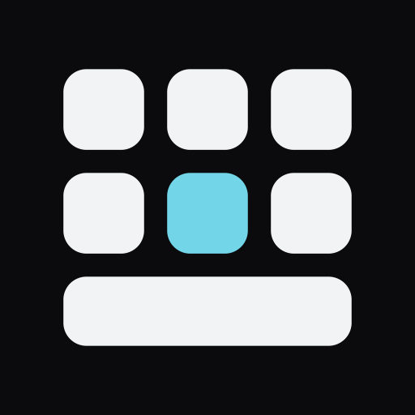
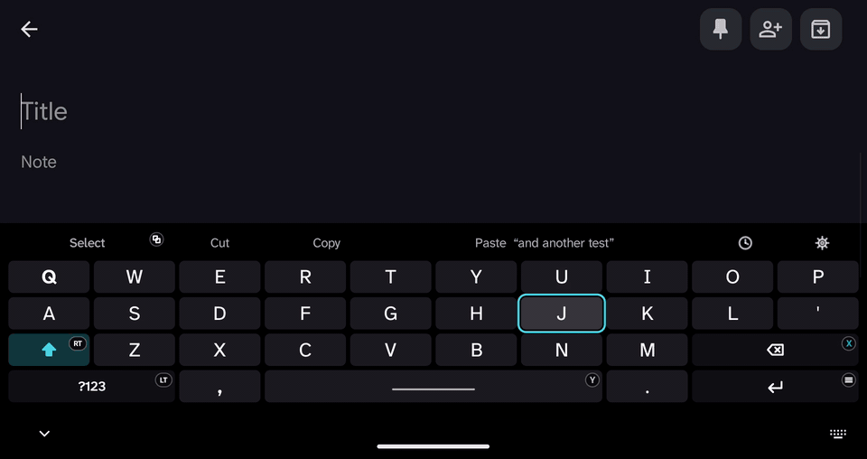
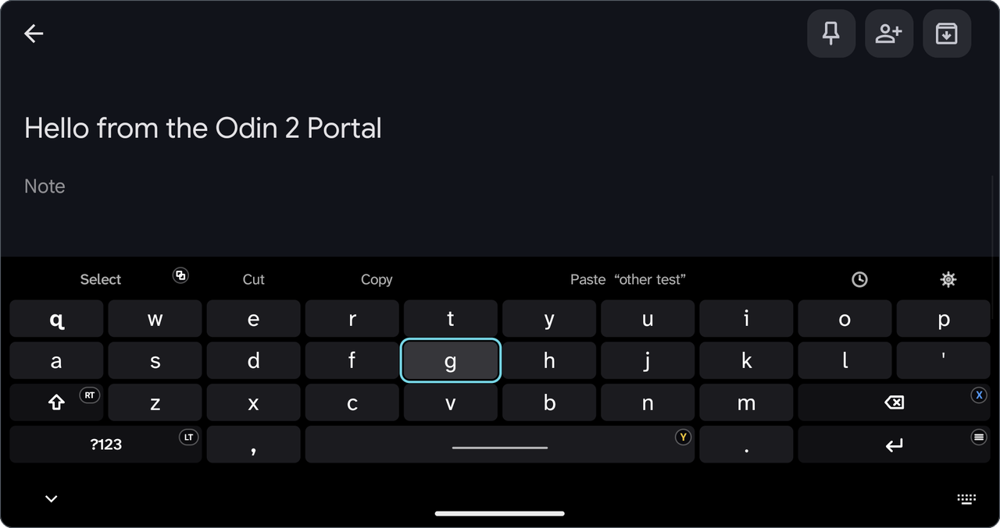
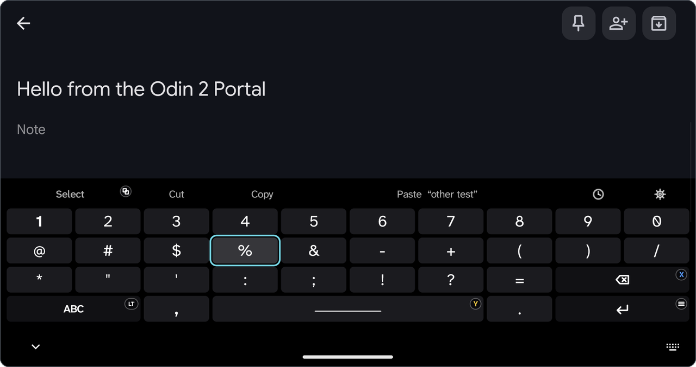
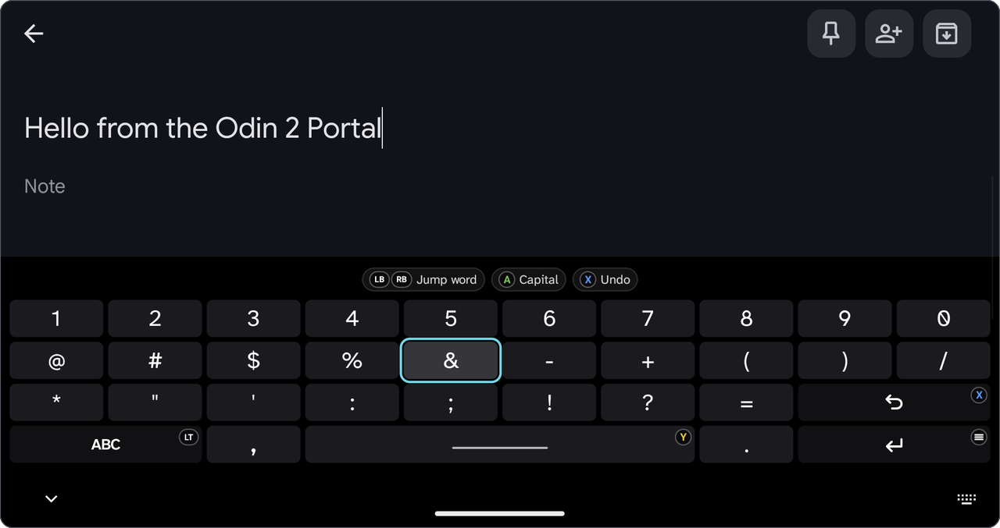
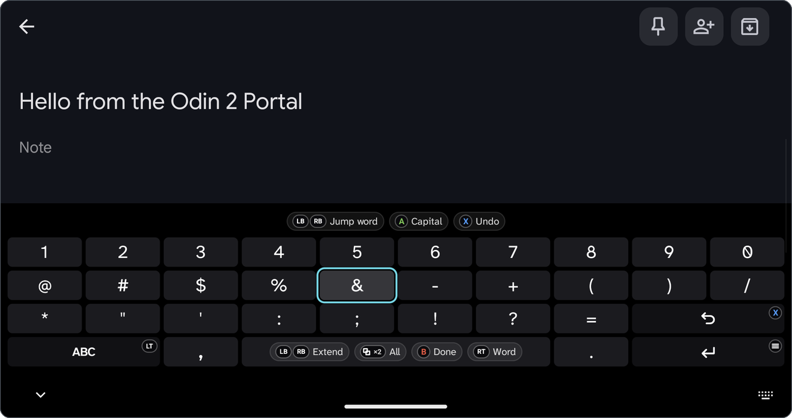
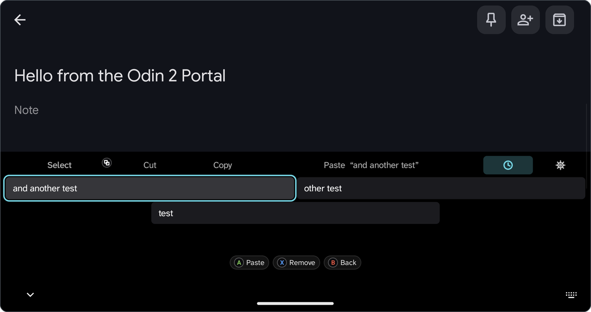
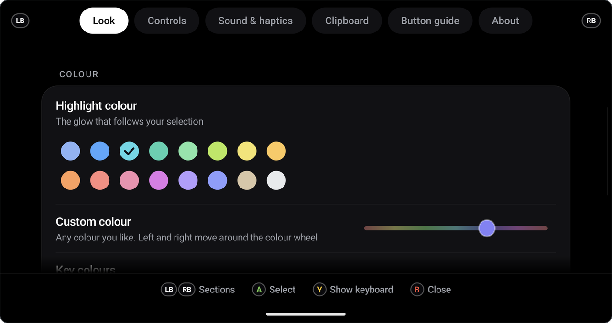
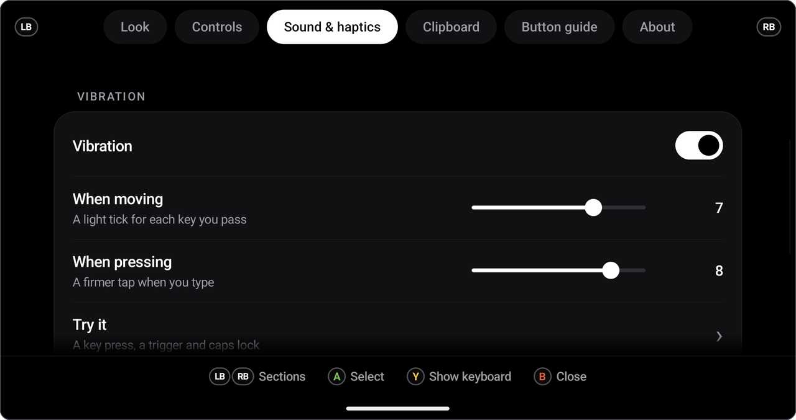
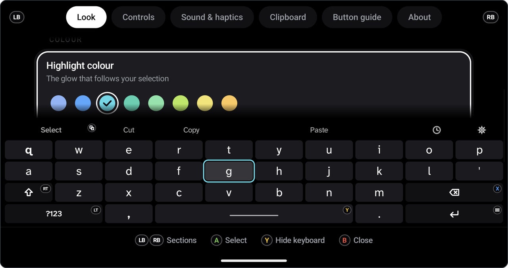

> This is a fork of [Inlay](https://github.com/dakingeman/inlay).
> I'm using this fork to experiment with additional features and
> improvements that I'd like to have in the project.

# Inlay

**A gamepad keyboard for Android handhelds.** You drive it with the controller, not your thumbs on the glass.

Move with the D-pad or stick, press A to type, and never reach for the touchscreen again. Made for handhelds like the AYN Odin and Retroid Pocket, and for any Android device with a gamepad connected.

Free, open source, no ads, no tracking, no internet permission.

  

**[Download the latest version](../../releases/latest)** · [How to install](#install) · [Report a problem](../../issues/new/choose)

*A real screen recording from my AYN Odin 2 Portal: typing with the D-pad and A, Y for space, RT for a capital letter and LT for numbers and symbols.*

## Who made this

I'm Emre, and I don't write code. I want to say that plainly: every line of this app was written by Claude, Anthropic's AI. My part was the idea, deciding how it should look, feel and sound, and testing it on my AYN Odin 2 Portal, over and over, until it felt right. The sounds were made by Claude from scratch too, modelled on button sounds I picked out.

I'm sharing it to give something back to the community. There's no catch and nothing is for sale.

Since I can't read the code myself, I can't promise it's flawless, and it has only been tested on one device. If something goes wrong on yours, please open an issue and tell me what happened. If you can read code, improvements are very welcome.

## Screenshots

All of these are real screenshots from my Odin 2 Portal.

| | |
|---|---|
|  |  |
| **Letters.** The highlight follows the D-pad. Small badges show which button does what. | **Symbols.** Press LT to flip between letters and symbols. |
|  |  |
| **Hold RT.** Hints appear for jumping words, one capital letter and undo. | **Select mode.** Press Select, then LB / RB to extend. Press it twice to select everything. |
|  |  |
| **Clipboard history.** Your recent copies, one button away. | **Settings, Look.** 16 highlight colours plus any custom colour. |
|  |  |
| **Settings, Sound and haptics.** Vibration strength, sound packs and volume. | **Live preview.** Press Y in Settings to try your changes on the keyboard right away. |

---

## Features

- **Made for controllers.** D-pad or left stick moves the highlight, with smart repeat when you hold a direction.
- **Every button does something useful.**
  - A types, X deletes (hold it and it speeds up, then deletes whole words), Y is space, Start is enter.
  - Hold A on a letter to open its accented variants; use the D-pad and A to choose, or touch and hold the key. Acute accents appear first on vowels.
  - LB / RB move the cursor. Hold RT with them to jump whole words.
  - RT taps shift; tap twice for caps lock. LT switches to symbols.
  - Select starts selecting text; press it twice to select everything.
  - B closes the keyboard without sending Back to the app (the Switch button layout is respected).
- **Clipboard history.** Your last few copies, one button away. Passwords marked as sensitive are never kept.
- **Types straight into the app.** No full-screen typing box covering your game or launcher.
- **Sound and vibration that feel premium.** Four sound packs (Soft, Soft Deep, Tactile, Chime) and vibration tuned so even small motors are felt.
- **Make it yours.** 16 highlight colours plus any custom colour, 8 OLED-friendly key colours, four highlight styles, three key shapes, two layouts, three sizes, and controller icons in Xbox, PlayStation or Switch style.
- **Fits every screen.** Wide, 4:3, portrait or split screen: the keyboard scales itself so it never covers more than 60 % of the screen.
- **A Settings app you can use with the controller**, with a live keyboard preview (press Y).

## Requirements

- Android 10 or newer
- A built-in controller or a connected gamepad

## Tested on

| Device | Android | Result |
|---|---|---|
| AYN Odin 2 Portal | 13 | Everything tested |

Tried it on something else? Please [tell me how it went](../../issues/new/choose), even if it worked perfectly. That's how this list grows.

## Install

1. Download the latest `.apk` file from the [Releases](../../releases) page onto your device.
2. Open it and allow installing from this source when Android asks.
3. Open **Inlay** and choose **About → Turn on Inlay**.
4. Choose **About → Switch keyboard** to make it the active keyboard.

Tip: the [Obtainium](https://github.com/ImranR98/Obtainium) app can watch this page and update Inlay for you.

## Build it yourself

Open the project in Android Studio and press **Run**. No extra libraries are needed.

## Credits

- Fonts: [Atkinson Hyperlegible Next](https://github.com/googlefonts/atkinson-hyperlegible-next) and [Inter](https://github.com/rsms/inter), both under the SIL Open Font Licence (see `licenses/`).
- All sounds were made for this project from scratch (the scripts that made them are in `tools/`).

## Licence

See the `LICENSE` file.
